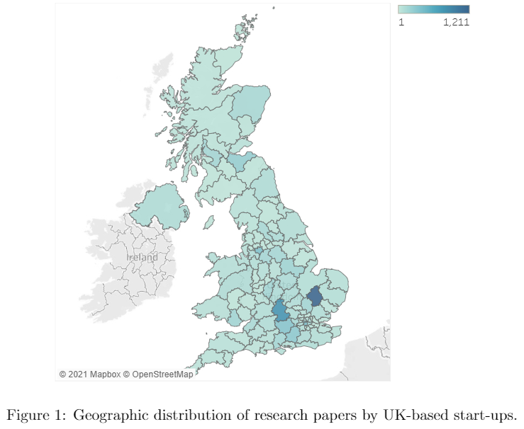
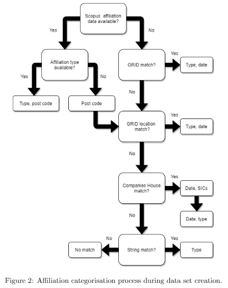
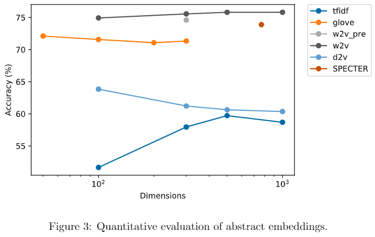
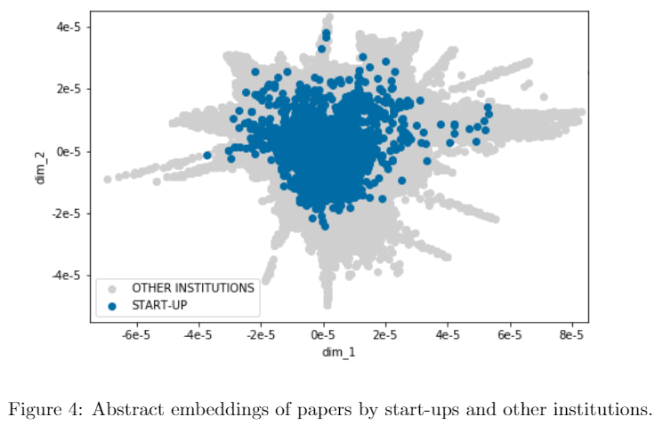

# Start-ups: Towards an Understanding of Their Role in Science

Tableau Public workbook is available to view [here](https://public.tableau.com/app/profile/aidan7289/viz/Start-upDashboard_16371521799260/Start-upDashboard).

The final data set can be found [here](https://drive.google.com/drive/folders/109iC9NNeH4EwJBQpdbijQcGvGbpzMCTf?usp=sharing).

    

## Data Set Creation

Data set creation involved:

1. Identifying available data sources
2. Selecting optimal data sources based on their individual and collective merits
3. Collecting and cleaning data from the chosen four: Scopus, Global Research
Identifier Database, Companies House, and Financial Analysis Made Easy
4. Consolidating data sources into one data set using string matching (Levenshtein
  algorithm) and geographic data
5. Categorising research affiliations into types of institutions according to Figure 2
6. Identifying start-ups from the list of companies using an extended definition to
what has been used in the entrepreneurship literature

    

## Statistical Testing

Statistical testing identified two main results:

1. The research focus of start-ups was different to other institutions - start-ups
focused more on applied research over basic research.
2. The quality of research by start-ups was worse than other institutions - quality
was determined through citation and journal quality metrics.

## Generating Abstract Embeddings

Various embedding techniques were attempted. In order of increasing complexity,
the techniques used were:

+ Term Frequency-Inverse Document Frequency - [scikit-learn](https://scikit-learn.org/stable/modules/generated/sklearn.feature_extraction.text.TfidfVectorizer.html)
+ GloVe - [gensim](https://radimrehurek.com/gensim/auto_examples/howtos/run_downloader_api.html)
+ Word2vec: pre-trained and trained - [gensim](https://radimrehurek.com/gensim/models/word2vec.html)
+ Doc2vec - [gensim](https://radimrehurek.com/gensim/models/doc2vec.html)
+ SPECTER - [AllenAI](https://github.com/allenai/specter) - an interesting model
that uses [Sci-BERT](https://github.com/allenai/scibert) and is trained using an
objective function that incorporates research paper embeddings and the citation
graph of the respective papers

## Evaluating Abstract Embeddings

Due to the nature of abstract embeddings, standard evaluation metrics such as
mean squared error could not be used. Therefore, 10,000 triplets of research papers
were created to find the cosine similarity between two related papers, and one
unrelated paper. Qualitative evaluation was also carried out to confirm the ability
of the abstract embeddings to capture the semantic meaning of abstracts.

    

## Abstract Embedding Visual Inspection

    

Visualising the abstract embeddings, like in Figure 4, revealed there were areas
of semantic space where start-ups did not publish. Two explanations for the absence
of start-up papers were proposed:

1. A lack of monetisation of the research
2. The desire to protect intellectual property.

# To-do

1. Finish tidying code
